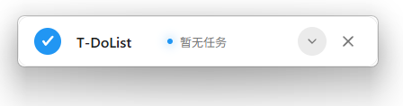
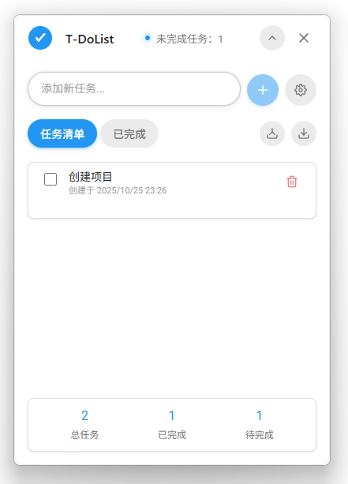

# T-DoList

<div align="center">
  
  
  **轻量级桌面任务清单应用**
  
  [](https://github.com/ataoyan/T-DoList)
  [](LICENSE)
  [](https://github.com/ataoyan/T-DoList)
  [](https://tauri.app/)
</div>

## ✨ 特性

- 🎯 **极简设计** - 专注于任务管理的核心功能
- 🚀 **高性能** - 基于 Tauri 构建，原生性能体验
- 🌙 **深色模式** - 支持浅色/深色主题切换
- 🎨 **主题定制** - 多种主题色彩选择
- 📌 **窗口置顶** - 始终保持在最前端，不错过任何任务
- 🔒 **窗口固定** - 防止意外拖拽，专注工作
- 📊 **任务统计** - 实时显示任务完成情况
- 💾 **数据导入导出** - 支持任务数据的备份和迁移

## 🖼️ 预览

<div align="center">
  
</div>

<div align="center">
  
</div>

## 🚀 快速开始

### 系统要求

- ✅ Windows 10/11
- ❌ macOS 10.15+ (暂不支持)
- ❌ Linux (Ubuntu 18.04+) (暂不支持)

### 安装

#### 从 Releases 下载

1. 访问 [Releases 页面](https://github.com/ataoyan/T-DoList/releases)
2. 下载适合您系统的安装包
3. 运行安装程序

#### 从源码构建

```bash
# 克隆仓库
git clone https://github.com/ataoyan/T-DoList.git
cd T-DoList

# 安装依赖
npm install

# 开发模式运行
npm run tauri:dev

# 构建应用
npm run tauri:build
```

## 📖 使用指南

### 基本操作

- **添加任务**: 在输入框中输入任务内容，按回车或点击加号按钮
- **完成任务**: 点击任务前的复选框
- **删除任务**: 点击任务右侧的删除按钮
- **查看详情**: 点击任务文本查看完整内容

### 高级功能

- **窗口置顶**: 在设置中开启"置于顶层"
- **窗口固定**: 在设置中开启"窗口固定"，防止意外拖拽
- **主题切换**: 在设置中选择喜欢的主题色和外观模式
- **数据管理**: 使用导入/导出功能备份和迁移任务数据

## 🛠️ 技术栈

- **前端**: Vue 3 + TypeScript + Vite
- **后端**: Rust + Tauri
- **样式**: CSS3 + CSS Variables
- **构建工具**: Tauri CLI

## 📁 项目结构

```
T-DoList/
├── src/                    # 前端源码
│   ├── App.vue            # 主应用组件
│   ├── main.ts            # 应用入口
│   └── utils/             # 工具函数
├── src-tauri/             # Tauri 后端
│   ├── src/               # Rust 源码
│   ├── Cargo.toml         # Rust 依赖
│   └── tauri.conf.json    # Tauri 配置
├── public/                # 静态资源
├── package.json           # Node.js 依赖
└── README.md             # 项目说明
```

## 🔧 开发

### 环境准备

```bash
# 安装 Node.js (推荐 18+)
# 安装 Rust
curl --proto '=https' --tlsv1.2 -sSf https://sh.rustup.rs | sh

# 安装 Tauri CLI
cargo install tauri-cli
```

### 开发命令

```bash
# 启动开发服务器
npm run dev

# 启动 Tauri 开发模式
npm run tauri:dev

# 构建生产版本
npm run tauri:build

```

## 📝 更新日志

### v0.2.0 (2025-11-03)

- 🐛 **修复** 任务数量过多时分页按钮超出页面的问题
- 🎨 **优化** 完成任务后不再自动切换到已完成页面，提供更流畅的操作体验

### v0.1.0 (2025-10-25)

- ✨ 初始版本发布
- 🎯 基础任务管理功能
- 🌙 深色模式支持
- 🎨 主题色彩定制
- 📌 窗口置顶功能
- 🔒 窗口固定功能
- 💾 数据导入导出
- 🎉 完成庆祝动画

## 📄 许可证

本项目基于 [MIT 许可证](LICENSE) 开源。

## 👨‍💻 作者

**ATao** - [@ataoyan](https://github.com/ataoyan)

---

<div align="center">
  <p>如果这个项目对您有帮助，请给它一个 ⭐️</p>
  <p>Made with ❤️ by ATao</p>
</div>
